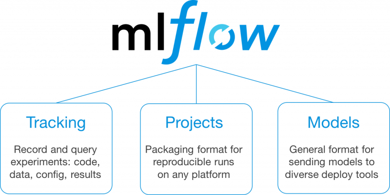

# Welcome !

This is MLflow training. You are going to learn how to use MLflow in order to :
* build reproducible ML pipeline
* package models
* deploy models

# Slides

# Documentation

* [Set up](documentation/setup.md)
* [Data](documentation/data.md)
* [Exercises](documentation/exercises.md)
* [Entry points](documentation/entry_points.md)
* [MLflow cheatsheet](documentation/mlflow_cheatsheet.md)
* [Differences with code template](documentation/diff_template.md)
