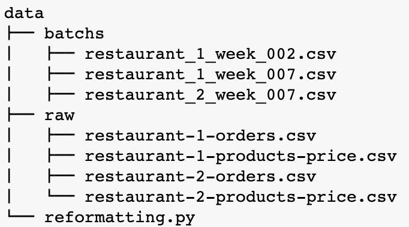
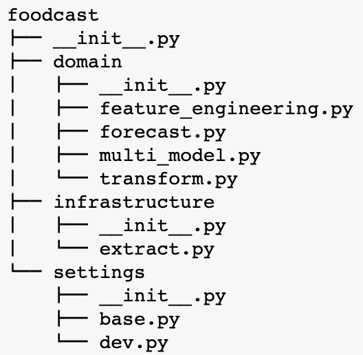
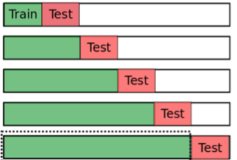
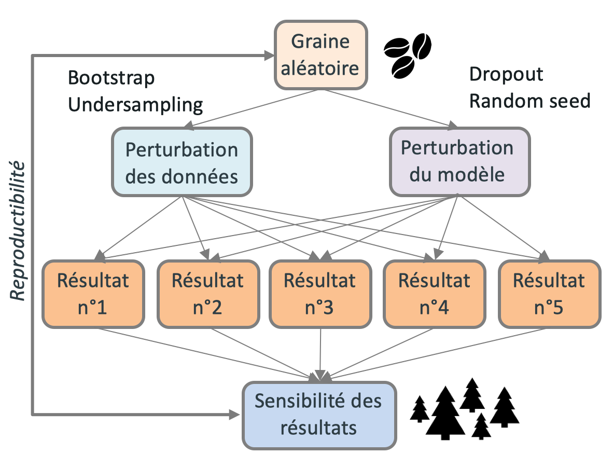

---
jupyter:
  jupytext:
    formats: ipynb,md
    text_representation:
      extension: .md
      format_name: markdown
      format_version: '1.2'
      jupytext_version: 1.4.0
  kernelspec:
    display_name: foodcast
    language: python
    name: foodcast
---

# Foodcast - food forecasting
Dans ce notebook, on se propose d'explorer et comprendre les différentes briques élémentaires d'un problème de prévision hebdomadaire de chiffre d'affaire. L'introduction de [MLflow](https://mlflow.org/) se fera dans un second temps.

Le jeu de données est [celui-ci](https://www.kaggle.com/henslersoftware/19560-indian-takeaway-orders) et se trouve dans le répertoire `data` du projet. Le répertoire `data/raw` contient les données telles quelles.

Le scénario est le suivant : une chaîne de restauration possède plusieurs restaurants dans une ville donnée. Chaque restaurant enregistre la totalité de ses ventes. La chaîne veut pouvoir prédire son volume de chiffre d'affaire d'une semaine sur l'autre, tous établissements confondus.

L'idée est de se mettre en conditions de production, avec un rythme de prédiction hebdomadaire. Chaque semaine, un pipeline de traitement et de prévision est à activer. Pour émuler ce genre d'environnements, nous avons découpé les données en batchs hebdomadaires dans `data/batchs` à l'aide du script `reformatting.py`. Par souci de simplicité, les semaines sont identifiées avec un nombre entier



Dans ce notebook, on aborde les étapes suivantes du pipeline :
* [Importation des librairies](#part0)
* [Chargement et nettoyage des données](#part1)
* [Feature engineering sur le jeu d'entraînement (offline)](#part2)
* [Entraînement d'un modèle prédictif](#part3)
* [Feature engineering sur le jeu de prédiction (online)](#part4)
* [Prévision et visualisation](#part5)
* [Incertitudes de modélisation](#part6)

**A noter :** toutes les fonctions élémentaires qui implémentent ces étapes sont **déjà codées**. Dans ce notebook, il s'agit simplement de se familiariser avec.


# Importation des librairies

<a class='anchor' id='part0'></a>

La structure du projet est la suivante :



**A noter :** il manque le répertoire `application` du template DDD. Ce répertoire est celui qui hébergera tous nos appels à [MLflow](https://mlflow.org/), et sera construit au fur et à mesure de la présente formation.

Dans la suite, nous aurons besoin des fonctions suivantes. Nous allons illustrer leur usage dans ce notebook.

```python
import sys
sys.path.append('..')
import yaml
import logging
import logging.config
import pandas as pd
pd.set_option('display.min_rows', 500)
pd.set_option('display.max_rows', 500)
pd.set_option('display.max_columns', 500)
pd.set_option('display.width', 500)
pd.set_option('max_colwidth', 400)
from foodcast.domain.transform import etl
from foodcast.domain.feature_engineering import features_offline, features_online
from foodcast.domain.forecast import span_future, cross_validate, plotly_predictions
from foodcast.domain.multi_model import MultiModel
from sklearn.ensemble import RandomForestRegressor
import foodcast.settings as settings
import plotly.graph_objects as go

with open(settings.LOGGING_CONFIGURATION_FILE, 'r') as f:
    logging.config.dictConfig(yaml.safe_load(f.read()))

%load_ext autoreload
%autoreload 2
```

# Chargement et nettoyage des données

<a class='anchor' id='part1'></a>

Dans cette partie, on se focalise sur le pré-traitement des données.

### Fonctions élémentaires

Le pré-traitement qui suit se déroule en quatre étapes, chacune étant encodée dans une fonction élémentaire :
* `extract` : charge les données d'un restaurant dans un intervalle de temps défini par l'utilisateur
* `clean` : nettoie le jeu de donnée correspondant :
    * homogénéisation des noms de colonnes
    * corrections des dtypes
    * agrégation du montant à la maille transaction
    * suppression des colonnes inutiles
    * tri chronologique
* `merge` : fusionne les données de chaque restaurant en un seul dataframe représentant la chaîne de restauration
* `resample` : réechantillonne le jeu de données à la maille heure

### Exercices

Ces quatre fonctions sont encapsulées dans une seule et unique fonction maître, appelée `etl`, qui fait l'objet du prochain exercice.

```python
etl??
```

**Exercice :** extraire un jeu de données entièrement pré-traité pour les semaines 197 à 200.

**Indice :** le nom du répertoire où se situe les données est stocké dans `settings.DATA_DIR`.

```python
df = None
```

**Exercice :** tracer le chiffre d'affaire en fonction du temps avec [plotly](https://plotly.com/python/line-charts/#line-plot-with-goscatter).

```python
fig = go.Figure()
pass
fig.update_layout(
    title='Cash-in',
    xaxis_title='date',
    yaxis_title='dollars',
    font=dict(
        family='Computer Modern',
        size=18,
        color='#7f7f7f'
    )
)
```

# Feature engineering sur le jeu d'entraînement (offline)

<a class='anchor' id='part2'></a>

Dans cette partie, on se focalise sur le feature engineering et la création du jeu d'entraînement.

### Fonctions élémentaires
Le feature engineering qui suit se déroule en trois étapes, chacune étant encodée dans une fonction élémentaire :
* `dummy_day` : encode le jour de la semaine en 6 variables binaires.
* `hour_cos_sin` : encode l'heure de la journée en 2 variables continues.
* `lag_offline` : récupère le chiffre d'affaire d'une semaine dans le passé.

Au niveau implémentation, `lag_offline` est un simple `shift` de la cible sur le jeu d'entraînement.

### Exercices

Ces trois fonctions sont encapsulées dans une seule et unique fonction maître, appelée `features_offline`, qui fait l'objet du prochain exercice.

```python
features_offline??
```

**Exercice :** effectuer le feature engineering sur le jeu d'entraînement obtenu précédemment.

```python
df = None
```

**Exercice :** vérifier à la main sur une ligne ou deux la validité de la variable `lag_1W` créée.

```python
pass
```

### Séparation variable/cible

On sépare le jeu de données obtenu en variables explicatives et variable cible, en prenant soin de conserver l'information de la date.

```python
# Uncomment to achieve exercise

# x_train = df.drop(columns=['cash_in'])
# y_train = df[['order_date', 'cash_in']]
# x_train = x_train.set_index('order_date')
# y_train = y_train.set_index('order_date')['cash_in']
```

# Entraînement d'un modèle prédictif

<a class='anchor' id='part3'></a>

Dans cette partie, on se focalise sur l'entraînement d'un modèle prédictif et sa validation.

### Un premier modèle
Pour commencer, on se propose d'introduire un modèle de type forêt aléatoire avec 10 arbres. 

**Exercice :** créer une instance de `RandomForestRegressor` contenant 10 arbres, avec une graine aléatoire fixée (de votre choix).

```python
simple_model = RandomForestRegressor(n_estimators=10, random_state=42)
```

### Validation croisée temporelle sur le jeu d'entraînement

La validation croisée temporelle est naturelle pour un problème de forecast. Elle est en fait naturelle pour tout cycle de vie des modèles sujet à une dérive des données.



C'est la fonction `cross_validate` qui l'implémente, en se basant sur [TimeSeriesSplit](https://scikit-learn.org/stable/modules/generated/sklearn.model_selection.TimeSeriesSplit.html) de scikit-learn.

```python
cross_validate??
```

**Exercice :** valider le modèle sur le jeu d'entraînement avec trois répétitions (folds).

```python
maes, preds = None, None
```

**Question :** en quelle unité s'exprime la MAE ? Compte tenu des patterns de consommation, est-ce vraiment un indicateur de performance pertinent ?


### Graphe des prédictions

On peut tracer les prédictions obtenues via la fonction `plotly_predictions`.

```python
plotly_predictions??
```

**Exercice :** tracer les prédictions obtenues par validation croisée, en regard de la vérité attendue.

```python
pass
```

### Entraînement sur la totalité du jeu de données

C'est la méthode `fit` de `RandomForestRegressor` qui est à l'oeuvre.

**Exercice :** entraîner le modèle sur tout le jeu d'entraînement.

**Indice :** on utilisera les dataframes `x_train` et `y_train` obtenus précédemment.

```python
pass
```

# Feature engineering sur le jeu de prédiction (online)

<a class='anchor' id='part4'></a>

Dans cette partie, on se focalise sur le feature engineering et la création du jeu de prédiction.

### Fonctions élémentaires
Le feature engineering qui suit se déroule en quatre étapes, chacune étant encodée dans une fonction élémentaire :
* `span_future`: génère les dates de prédiction dans le futur.
* `dummy_day` : encode le jour de la semaine en 6 variables binaires.
* `hour_cos_sin` : encode l'heure de la journée en 2 variables continues.
* `lag_online` : récupère le chiffre d'affaire d'une semaine dans le passé.

### Pourquoi lag offline et lag online ?

Par rapport au jeu d'entraînement, il est plus difficile de calculer un lag de chiffre d'affaire sur le jeu de prédiction car ce dernier est par définition dans le futur, et ne contient aucune information passée.

Deux méthodes sont possibles :

* **la méthode coûteuse en RAM :** il s'agit de concaténer `train` et `future` et de réaliser un `shift`. Si le `train` est volumineux, on occupe beaucoup d'espace mémoire alors que seule une petite quantité d'information nous intéresse.
* **la méthode recommandée :** il s'agit de charger uniquement les observations de la semaine passée, `past`, de concaténer avec `future`, et d'effectuer un `shift`. On utilise alors peu de mémoire (une semaine de données seulement).

### Exercices

Ces quatre fonctions sont encapsulées dans les fonctions `span_future` et `features_online`, qui font l'objet des prochains exercices.

Tout d'abord, nous générons un jeu `past` qui correspond à la semaine juste avant la semaine de prédiction.

**Exercice :** créer un jeu de données nettoyées `past` décrivant la semaine 200.

**Indice :** on pourra réutiliser la fonction `etl`.

```python
past = None
```

Ensuite, il faut générer le jeu de prédiction, c'est la fonction `span_future` qui s'y attèle.

```python
span_future??
```

**Exercice :** générer un dataframe de dates à prédire dans le futur du jeu d'entraînement.

**Indice :** on pourra utiliser `past['order_date'].max()` en guise de point de départ.

```python
future = None
```

Toutes les étapes de feature engineering online sont rassemblées dans la fonction `features_online`.

```python
features_online??
```

**Exercice :** créer un jeu de prédiction `future`, en utilisant la méthode recommandée de lag online (voir ci-dessus).

```python
future = None
```

**Exercice :** vérifier à la main sur une ligne ou deux la validité de la variable créée.

**Indice :** on pourra par exemple regarder en détail les variables calculées au 5 novembre 2018 à 18h.

```python
pass
```

On garde l'information sur la date dans l'index du jeu de prédiction.

```python
# Uncomment to achieve exercise

# future = future.set_index('order_date')
```

# Prévision et visualisation

<a class='anchor' id='part5'></a>

Dans cette partie, on se concentre sur la prédiction du chiffre d'affaire dans le futur du jeu d'entraînement.

### Prédiction du chiffre d'affaires

C'est la méthode `predict` de `RandomForestRegressor` qui entre en jeu.


**Exercice :** prédire le chiffre d'affaire sur le jeu de prédiction. 

**Indice :** on rangera les prédictions dans un `DataFrame` avec le même index que `future` et une seule colonne intitulée `y_pred_simple`.

```python
y_pred = None
```

### Visualisation des prédictions

On peut tracer les prédictions obtenues via la fonction `plotly_predictions`.


**Exercice :** tracer les prévisions de chiffre d'affaires sur le jeu de prédiction. 

```python
pass
```

# Incertitudes de modélisation

<a class='anchor' id='part6'></a>

Dans cette partie, on se propose d'ajouter une incertitude à nos prédictions. Une manière simple d'obtenir une incertitude sur les résultats est de perturber aussi bien le jeu de données que le modèle, comme illustré ci-contre.



C'est la classe `MultiModel` qui implémente ce schéma : 
* bootstrap sur les données
* variation de graine aléatoire du modèle (si elle existe). 

D'un point de vue design pattern, il s'agit d'un [décorateur](https://refactoring.guru/design-patterns/decorator).

```python
MultiModel?
```

**Exercice :** implémenter un `MultiModel` contenant 10 répliques de `simple_model`.

```python
multi_model = None
```

### Validation croisée temporelle sur le jeu d'entraînement


**Exercice :** valider le modèle sur le jeu d'entraînement avec trois répétitions (folds).

**Indice :** la syntaxe est identique à celle utilisée pour `simple_model`.

```python
maes, preds = None, None
```

**Question :** quelle est la moyenne et l'écart-type des MAEs sur chaque répétition de la validation croisée ?

**Indice :** `axis=1`

```python
pass
```

### Graphe des prédictions

On peut tracer les prédictions obtenues via la fonction `plotly_predictions`. Cette fonction gère bien les prédictions d'un multi-modèle. En particulier, elle ne trace pas une courbe de prédiction mais une *plage* de prédictions.


**Exercice :** tracer les prédictions obtenues par validation croisée, en regard de la vérité attendue.

**Indice :** la syntaxe est identique à celle utilisée pour `simple_model`.

```python
pass
```

### Entraînement sur la totalité du jeu de données

C'est la méthode `fit` de `MultiModel` qui est à l'oeuvre.

```python
MultiModel.fit??
```

**Exercice :** entraîner le modèle sur tout le jeu d'entraînement.

**Indice :** on utilisera les dataframes `x_train` et `y_train` obtenus précédemment.

```python
pass
```

### Prédiction du chiffre d'affaires

C'est la méthode `predict` de `MultiModel` qui entre en jeu.

```python
MultiModel.predict??
```

**Exercice :** prédire le chiffre d'affaire sur le jeu de prédiction.

**Indice :** on fera attention à l'API non-standard de la méthode `predict`. En effet, la méthode `predict` contient un argument supplémentaire, le `context`. Cette spécificité est nécessaire pour être compatible avec [MLflow](https://mlflow.org/), mais deviendra invisible par la suite.

```python
y_pred = None
```

### Visualisation des prédictions avec incertitude

On peut tracer les prédictions obtenues via la fonction `plotly_predictions`.


**Exercice :** tracer les prévisions de chiffre d'affaires sur le jeu de prédiction. 

**Indice :** la syntaxe est identique à celle utilisée pour `simple_model`.

```python
pass
```

# Félicitations !

Vous maîtrisez maintenant le code food forecasting et vous avez implémenté un modèle [compatible avec MLflow](https://www.mlflow.org/docs/latest/models.html#model-customization) !

### Pour aller plus loin

Dans le notebook suivant, nous aborderons :
* le tracking et la reproductibilité
* le packaging de modèles
* la visualisation dans l'interface graphique
