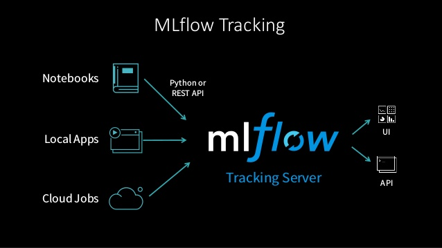

---
jupyter:
  jupytext:
    formats: ipynb,md
    text_representation:
      extension: .md
      format_name: markdown
      format_version: '1.2'
      jupytext_version: 1.4.0
  kernelspec:
    display_name: foodcast
    language: python
    name: foodcast
---

# MLflow tracking

Dans ce notebook, on se propose d'implémenter la chaîne de traitement du problème *food forecasting* en interaction avec les API [tracking](https://www.mlflow.org/docs/latest/tracking.html) et [flavours](https://www.mlflow.org/docs/latest/models.html#model-customization) de [MLflow](https://mlflow.org/).




Dans la suite, on se propose de comparer deux manières de travailler :
* [MLflow tracking : tutoriel](#part1)
    * [Générer des logs](#spart11)
    * [Organiser les logs dans des runs](#spart12)
    * [Organiser les runs dans des expériences](#spart13)
* [Chaîne de traitement foodcast avec MLflow](#part2)
    * [Loading](#spart21)
    * [Offline feature engineering](#spart22)
    * [Validating](#spart23)
    * [Training](#spart24)
    * [Online feature engineering](#spart25)
    * [Predicting](#spart26)


___
# MLflow tracking : tutoriel

<a class='anchor' id='part1'></a>

Dans cette partie, nous allons découvrir les principes de base de [MLflow tracking](https://www.mlflow.org/docs/latest/tracking.html).

```python
import os
import sys
sys.path.append('..')
import yaml
import logging
import logging.config
from foodcast.domain.transform import etl
from foodcast.domain.multi_model import MultiModel
from foodcast.application.mlflow_utils import mlflow_log_pandas, mlflow_log_plotly
from sklearn.ensemble import RandomForestRegressor
import foodcast.settings as settings
import mlflow
import mlflow.sklearn
import mlflow.pyfunc

with open(settings.LOGGING_CONFIGURATION_FILE, 'r') as f:
    logging.config.dictConfig(yaml.safe_load(f.read()))

%load_ext autoreload
%autoreload 2
```

## Générer des logs

<a class='anchor' id='spart11'></a>

L'idée générale est la sauvegarde d'informations dans des fichiers. Ce processus de sauvegarde s'appelle le logging.


### Logger des paramètres

L'information la plus simple à logger est le paramètre. Un paramètre est un couple clef-valeur : la clef est un nom (une chaîne de caractère), et la valeur est un objet python de base (`float`, `string` etc.).

**Exercice :** logger un paramètre `age`, contenant votre âge (en années).

**Indice :** on utilisera la méthode [mlflow.log_param](https://www.mlflow.org/docs/latest/python_api/mlflow.html#mlflow.log_param).

```python
pass
```

**Question :** Un nouveau répertoire vient d'être créé : où ça ? comment s'appelle-t-il ? où se trouve l'information loggée ?


### Naviguer dans l'interface graphique

<a class='anchor' id='ui'></a>

Dans toute la suite, les run [MLflow](https://mlflow.org/) seront visualisables via une interface graphique intégrée. Pour en profiter :
* accédez au terminal
* chargez votre environnement virtuel : `conda activate foodcast`
* tapez `mlflow ui` **dans le répertoire de travail** (en l'occurrence : `notebooks/`)
* copiez-collez l'adresse (a priori http://127.0.0.1:5000) dans votre navigateur web

**Astuce :** ajoutez l'adresse à vos marque-page favoris.

Cette interface graphique est simplement un utilitaire qui lit le répertoire `mlruns` créé par [MLflow](https://mlflow.org/).

**Exercice :** retrouver l'information loggée en navigant dans l'interface graphique [MLflow](https://mlflow.org/).

```python
# Follow the steps above to achieve this exercise
```

**Exercice :** logger deux paramètres en une seule ligne de code : `age` (votre âge) et `age_voisin` (l'âge de votre voisin de gauche).

**Indice :** on utilisera la méthode [mlflow.log_params](https://www.mlflow.org/docs/latest/python_api/mlflow.html#mlflow.log_params).

```python
pass
```

### Logger un modèle standard

Au-delà des paramètres, [MLflow](https://mlflow.org/) fournit une convention pour stocker les modèles prédictifs.

**Exercice :** logger un `RandomForestRegressor` quelconque dans un répertoire intitulé `my_random_forest`.

**Indice :** on pourra se baser sur [mlflow.sklearn.log_model](https://www.mlflow.org/docs/latest/python_api/mlflow.sklearn.html#mlflow.sklearn.log_model)

```python
pass
```

**Question :** qu'est-ce qu'un modèle dans la convention [MLflow](https://mlflow.org/) ?


### Logger un modèle personnalisé

Si vous voulez sortir des sentiers battus et logger un modèle fait maison, il doit hériter de la classe `PythonModel` de [MLflow](https://mlflow.org/) (c'est le cas par exemple de notre `MultiModel`). Par contre, pour logger ce modèle (et plus tard le déployer), il faut fournir des informations supplémentaires, à savoir :
* le code qui permet de connaître l'API du modèle et de le désérialiser
* les dépendances du modèles, renseignées sous la forme d'un environnement virtuel de déploiement.

**Exercice :** logger un `MultiModel` quelconque dans un répertoire intitulé `my_multi_model`

**Indice :** on pourra se baser sur [mlflow.pyfunc.log_model](https://www.mlflow.org/docs/latest/python_api/mlflow.pyfunc.html#mlflow.pyfunc.log_model). On prendra garde aux arguments :
* `code_path` : chemin vers le module contenant la définition du modèle
* `conda_env` : dictionnaire représentant l'environnement virtuel nécessaire au déploiement du modèle.

```python
code_path=[os.path.join('..', 'foodcast', 'domain', 'multi_model.py')]
conda_env={
    'channels': ['defaults', 'conda-forge'],
    'dependencies': [
        'mlflow=1.8.0',
        'numpy=1.17.4',
        'python=3.7.6',
        'scikit-learn=0.21.3',
        'cloudpickle==1.3.0'
    ],
    'name': 'multi-model-env'
}
pass
```

**Question :** quelles  différences avec le cas précédent dans `mlruns` ?


### Logger des fichiers

Enfin, pour tout le reste, [MLflow](https://mlflow.org/) permet de logger des fichiers. A titre d'illustration,  on se munit d'un dataframe, qui n'est ni un paramètre ni un modèle.

```python
data = etl(settings.DATA_DIR, 199, 200)
```

Comme [MLflow](https://mlflow.org/) ne fournit pas spécialement de méthode `log` pour les dataframes, il faut d'abord le sauvegarder dans un fichier et ensuite logger le fichier.

**Exercice :** sauvegarder `data` dans un fichier `data.csv`.

**Indice :** on ne sauvegardera par l'index.

```python
pass
```

**Exercice :** logger le fichier `data.csv` dans un répertoire `data`.

**Indice :** on utilisera la méthode [mlflow.log_artifact](https://mlflow.org/docs/latest/python_api/mlflow.html#mlflow.log_artifact).

```python
pass
```

**Exercice :** supprimer le fichier `data.csv` qui se balade dans votre répertoire `notebooks`.

**Indice :** vous pouvez lancer une commande du terminal directement dans une cellule jupyter, en la préfixant d'un `!`

```python
pass
```

**Question :** est-ce que le fichier `data.csv` loggé est toujours dans `mlruns` ?


### Point factorisation

Un pattern va devenir récurrent avec [MLflow](https://mlflow.org/) : 
* sauvegarder des données en local
* logger les données locales dans un run, via `log_artifact`

L'inconvénient est que cela pollue inutilement le répertoire de travail avec des artéfacts. Pour pallier à ces problèmes, vous pouvez utiliser le module `mlflow_utils` (fait maison).

Les fonctions `mlflow_log_pandas` et `mlflow_log_plotly` ont les mêmes arguments que `mlflow.log_artifact`, mais ne polluent pas le répertoire courant. A la place, les données intermédiaires (avant d'être loggées) sont stockées dans votre répertoire `/tmp`, qui est vidé à chaqe redémarrage de votre ordinateur.

```python
mlflow_log_pandas??
```

**Exercice :** logger le dataframe `data` dans `artifacts/data/data.csv` en utilisant `mlflow_log_pandas`.

```python
pass
```

## Organiser les logs dans des runs

<a class='anchor' id='spart12'></a>

Pour l'instant, toutes nos opérations précédentes ont été loggées au même endroit. Si l'on relance les cellules précédentes, toutes les informations seront écrasées. C'est parce que nous avons travaillé jusqu'alors dans un seul et unique run.

Les run sont la structure de base de [MLflow tracking](https://www.mlflow.org/docs/latest/tracking.html), et permettent des séparer les informations dans des répertoires différents.

### Encapsuler les logs
Afin d'obtenir un véritable historique des actions, il faut encapsuler les logs dans des runs.

Tout d'abord, il faut terminer le run en cours.

```python
mlflow.end_run()
```

Ensuite, on peut utiliser les runs comme des ContextManager, avec le mot-clé `with`.

```python
with mlflow.start_run():
    mlflow_log_pandas(data, 'data', 'data.csv')
```

**Exercice :** lancer la cellule précédente au moins deux fois.

```python
# Come on, this is an easy one.
```

**Question :** en navigant dans l'interface graphique, que constatez-vous sur le contenu du répertoire `mlruns` ?


### Examiner un run
En combinant `with` avec `as`, on peut sauvegarder le run dans une variable `my_run`. On peut même lui donner un nom `run_name`.

```python
with mlflow.start_run(run_name='my_run_name') as my_run:
    mlflow_log_pandas(data, 'data', 'data.csv')
```

**Exercice :** retrouver l'id du run précédent sans utiliser l'interface graphique.

**Indice :** on pourra utiliser l'[info du run](https://www.mlflow.org/docs/latest/python_api/mlflow.entities.html#mlflow.entities.Run).

```python
pass
```

**Exercice :** retrouver le chemin complet où le run enregistre les artéfacts sans utiliser l'interface graphique.

**Indice :** on pourra utiliser l'[info du run](https://www.mlflow.org/docs/latest/python_api/mlflow.entities.html#mlflow.entities.Run).

```python
pass
```

**Exercice :** retrouver le nom du run, sans utiliser l'interface graphique.

**Indice :** on pourra utilise les [les tags du run](https://www.mlflow.org/docs/latest/python_api/mlflow.entities.html#mlflow.entities.Run).

```python
pass
```

## Organiser les runs dans des expériences

<a class='anchor' id='spart13'></a>

Plutôt que d'entasser tous les runs au même endroit, on peut les ranger dans des répertoires spécifiques, appelés expériences. L'expérience par défaut s'appelle `Default` dans l'interface graphique, et correspond au sous-répertoire `0` dans `mlruns`.

**Astuce :** on peut penser les expériences comme des branches *features* dans git : dès que l'on cherche à développer une nouvelle fonctionalité, on crée une expérience correspondante, pour ne pas mélanger des runs qui n'ont rien à voir entre eux.

### Créer une expérience

On peut créer une expérience en python ou en ligne de commande.

**Exercice :** créer une expérience intitulée `my_experiment`.

**Indice :** la fonction [set_experiment](https://www.mlflow.org/docs/latest/python_api/mlflow.html#mlflow.set_experiment) permet de choisir une expérience par défaut si elle existe, et de la créer le cas échéant.

```python
pass
```

### Choisir une expérience

Le choix de l'expérience peut se faire au moment de l'exécution d'un run via l'argument `experiment_id` de `start_run`. Toutefois, maintenant que `my_experiment` est l'expérience par défaut, il n'y a même pas besoin de s'embêter !

**Exercice :** reprendre le dernier run que vous avez effectué et l'exécuter dans l'expérience `my_experiment`.

```python
# Come on, the code is elsewhere
```

**Question :** que s'est-il passé dans l'interface graphique ?


### Supprimer une expérience

La manière la plus sûre et définitive de supprimer une expérience est de supprimer le répertoire correspondant dans `mlruns` ainsi que le contenu de `mlruns/.trash`.

**Exercice :** supprimer l'expérience `my_experiment`.

**Indice :** on peut lancer une commande unix dans une cellule jupyter avec le préfixe `!`

```python
pass
```

**Question :** est-ce que l'expérience apparaît encore dans l'interface graphique ?


___
# Chaîne de traitement foodcast avec MLflow

<a class='anchor' id='part2'></a>

Pour rappel, le scénario est celui d'une prévision hebdomadaire de chiffre d'affaires. Le jeu d'entraînement est une fenêtre glissante par pas d'une semaine, et le jeu de prédiction est toujours la semaine suivante.

```python
import os
import sys
sys.path.append('..')
import yaml
import logging
import logging.config
from foodcast.domain.transform import etl
from foodcast.domain.feature_engineering import features_offline, features_online
from foodcast.domain.forecast import span_future, cross_validate, plotly_predictions
from foodcast.domain.multi_model import MultiModel
from foodcast.application.mlflow_utils import mlflow_log_pandas, mlflow_log_plotly
from sklearn.ensemble import RandomForestRegressor
import foodcast.settings as settings
import mlflow
import mlflow.sklearn
import mlflow.pyfunc

with open(settings.LOGGING_CONFIGURATION_FILE, 'r') as f:
    logging.config.dictConfig(yaml.safe_load(f.read()))

%load_ext autoreload
%autoreload 2
```

Si ce notebook était "mis en production", il faudrait le relancer chaque semaine en mettant à jour les paramètres suivants :
* `start_week`: le numéro de la première semaine d'entraînement,
* `end_week` : le numéro de la dernière semaine d'entraînement,
* `next_week` : le numéro de la semaine de prédiction.

```python
start_week = 180
end_week = 200
next_week = 201
```

## Création et sélection d'une expérience dédiée
Avant de commencer, on se propose de créer une expérience foodcast dédiée.

```python
mlflow.set_experiment('foodcast')
```

## Astuce

Dans la suite, on prendra garde à ce que les premières lignes de code après le `with mlflow.start_run()` soit celles qui loggent les paramètres du run. En cas de crash, vous aurez loggé l'information et pourrez plus facilement investiguer.


## Loading

<a class='anchor' id='spart21'></a>

Chargement et nettoyage des données d'entraînement sur la fenêtre glissante définie précédemment. Les données sont l'historique de chiffre d'affaires des deux restaurants considérés sur la fenêtre glissante d'entraînement définie au début de ce notebook.

**Exercice :** créer un run [MLflow](https://mlflow.org/) qui :
* s'intitule `load`
* log les paramètres `start_week` et `end_week`
* charge et nettoie les données d'entrée `data` via la fonction `etl`
* log `data` dans `data/data.csv`.

```python
pass
```

## Offline feature engineering

<a class='anchor' id='spart22'></a>

Feature engineering et séparation train/test.

**Exercice :** créer un run [MLflow](https://mlflow.org/) qui :
* s'intitule `features`
* log les paramètres `start_week` et `end_week`
* effectue le feature engineering via la fonction `features_offline`
* effecture la séparation variable/cible `x_train` / `y_train`
* log les dataframes obtenus dans `training_set/x_train.csv` et `training_set/y_train.csv`
* passe la date des événements en index pour `x_train` et `y_train`

```python
with mlflow.start_run(run_name='features'):
    # TODO: log parameters
    train = None
    x_train, y_train = None, None
    # TODO: log x_train
    # TODO: log y_train
    # x_train = x_train.set_index('order_date')
    # y_train = y_train.set_index('order_date')['cash_in']
```

## Validating

<a class='anchor' id='spart23'></a>

Instanciation du modèle et validation croisée chronologique.

**Exercice :** créer un run [MLflow](https://mlflow.org/) qui :
* s'intitule `validate`
* log les paramètres `start_week`, `end_week`, `n_fold`, `n_estimators`, `n_models`
* instancie un `MultiModel` random forest (`n_estimators=10`, `n_models=10`)
* valide le modèle par validation croisée temporelle (10-fold) via la fonction `cross_validate`
* log les prédictions obtenues dans `cross_validation/predictions.csv` (ne pas oublier de `reset_index()`)
* log la figure obtenue via `plotly_predictions` dans `plots/validation.html`
* log les métriques MAE minimum et maximum pour chaque étape de validation
* log les métriques MAE pour chaque estimateur du multi-modèle pour chaque étape de validation

```python
with mlflow.start_run(run_name='validate'):
    n_fold = 10
    n_estimators = 10
    n_models = 10
    # TODO: log parameters
    model = None
    maes, preds_train = None, None
    # TODO: log preds_train.reset_index()
    fig = None
    # TODO: log fig with mlflow_log_plotly
    # for i, mae in enumerate(maes):
    #     mlflow.log_metric('MAE_MIN', mae.min(), step=i)
    #     mlflow.log_metric('MAE_MAX', mae.max(), step=i)
    #     for j, result in enumerate(mae):
    #         mlflow.log_metric('MAE{}'.format(j), result, step=i)
```

**Exercice :** visualiser la plage de MAEs possible dans l'interface graphique. On considèrera la vue `step`.

```python
fig
```

## Training

<a class='anchor' id='spart24'></a>

Entraînement du modèle sur la totalité du jeu d'entraînement.

**Exercice :** créer un run [MLflow](https://mlflow.org/) qui :
* s'intitule `train`
* log les paramètres `start_week`, `end_week`, `n_estimators`, `n_models`
* entraîne le multi-modèle sur le jeu d'entraînement `x_train / y_train`
* log son attribut `single_estimator`, qui est un modèle scikit-learn standard, dans le répertoire `simple_model`
* log le modèle complet, qui est un modèle personnalisé, dans le répertoire `multi_model`

```python
pass
```

## Online feature engineering

<a class='anchor' id='spart25'></a>

Feature engineering et construction du jeu de prédiction.

**Exercice :** créer un run [MLflow](https://mlflow.org/) qui :
* s'intitule `future`
* log le paramètre `next_week`
* charge et nettoie un passé récent d'une semaine `past` pour calculer les lags de chiffre d'affaire, via la fonction `etl`
* génère jeu de prédiction `x_pred` via la fonction `span_future`
* effectue le feature engineering online via la fonction `features_online`
* log le jeu de prédiction obtenu dans `prediction_set/x_pred.csv`

```python
with mlflow.start_run(run_name='future'):
    # TODO: log parameters
    past = etl(settings.DATA_DIR, next_week - 1, next_week - 1)
    x_pred = span_future(past['order_date'].max())
    x_pred = None
    # TODO: log x_pred
```

## Predicting

<a class='anchor' id='spart26'></a>

Prédiction du modèle sur la semaine suivante.

**Exercice :** créer un run [MLflow](https://mlflow.org/) qui :
* s'intitule `predict`
* log les paramètres `next_week`, `start_week`, `end_week`, `n_estimators`, `n_models`
* passe la date en index dans `x_pred`
* prédise la chiffre d'affaires `y_pred` sur `x_pred`
* log les prédictions dans `predictions/y_pred.csv` (ne pas oublier de `reset_index()`)
* log la figure obtenue via `plotly_predictions` dans `plots/predictions.html`

```python
with mlflow.start_run(run_name='predict'):
    # TODO: log parameters
    # x_pred = x_pred.set_index('order_date')
    y_pred = None
    # log y_pred.reset_index()
    fig = None
    # log fig with mlflow_log_plotly
```

```python
fig
```

# Félicitations !

Vous maîtrisez maintenant la partie [tracking](https://www.mlflow.org/docs/latest/tracking.html) et la partie [model flavours](https://www.mlflow.org/docs/latest/tracking.html) de MLflow !

### Pour aller plus loin

Les points qu'ils nous restent à aborder dans cette formation sont :
* l'intégration avec le Template de Code
* l'implémentation d'une chaîne de traitement automatisée
* le déploiement de modèles sur un serveur

```python

```
